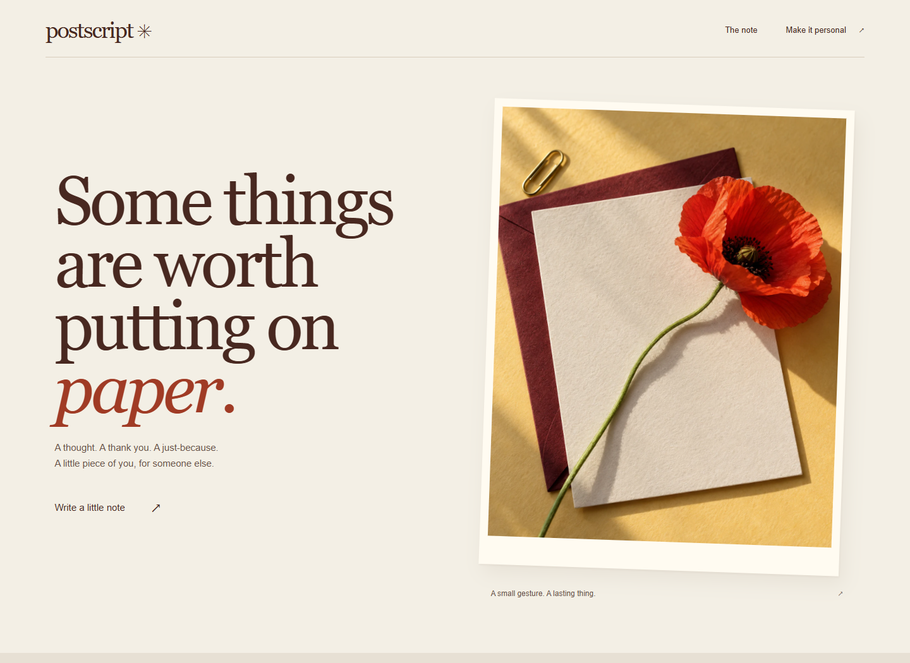
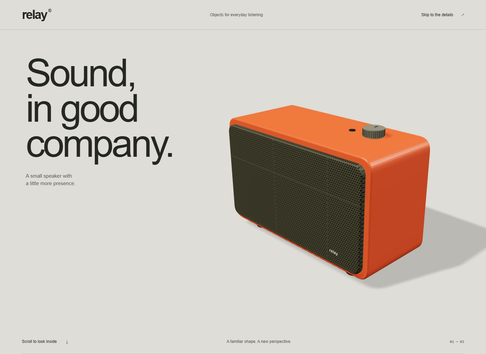

# Blend

A design skill for frontends with a clear visual direction and working task flows. Blend helps an agent choose a composition, build with real content, and revise the rendered result before delivery. It chooses small crafted interactions, scroll scenes, 3D, and imagery according to the page—not a fixed set of effects.

## See it in use

### Postscript · A note worth keeping

[](examples/postscript/index.html)

Generated imagery provides texture and atmosphere. A handwritten aside draws on hover or focus, paper lifts gently, and a note turns over as you personalize it. [Explore Postscript](examples/postscript/index.html).

### Relay · Look inside the object

[](examples/relay/index.html)

A live 3D speaker separates into shell, drivers, and grille as you scroll, then comes back together. Choose a finish and viewing angle. [Explore Relay](examples/relay/index.html).

Both are fictional demonstrations. Postscript downloads a local keepsake; nothing is sent. Relay is an illustrative object, not an engineering model or a product for sale. [Run the examples and study their decisions](examples/README.md).

## Use Blend

Copy this repository into your Codex skills directory as a folder named `blend`. Keep `SKILL.md`, references, and examples together. No source skills need to be installed separately.

For a new design:

```text
Use $blend to build a repair scheduling tool. Make finding and updating
a job easy, with a distinct visual direction and a usable mobile layout.
```

For existing work:

```text
Use $blend to refine this frontend. Preserve our copy, brand, and routes.
Inspect the render and fix the most important visual weaknesses.
```

## Inside the skill

- [Core workflow](SKILL.md): scope, design, copy, behavior, and the visual revision pass.
- [Art direction](references/art-direction.md): choose a composition, type roles, density, and assets from the brief.
- [Product workflows](references/product-workflows.md): navigation, records, forms, and task continuity.
- [Landing pages](references/landing-pages.md): offer, evidence, conversion paths, and discovery checks.
- [Motion direction](references/motion-direction.md): choose effects and visual media, then direct staging, continuity, and pace.
- [Motion recipes](references/motion-recipes.md), [scroll scenes](references/scroll-scenes.md), and [3D and mascots](references/3d-and-mascots.md): conditional techniques, not required effects.
- [Verification](references/verification.md): behavior checks and a method for evaluating draft quality across fresh runs.

## Develop and verify

With Python 3 installed, serve the repository from its root:

```sh
python -m http.server 18789 --bind 127.0.0.1
```

Open [the example gallery](http://127.0.0.1:18789/examples/). There is no package installation or build step. Follow the [example checks and preview instructions](examples/README.md) after changes, and the [verification guide](references/verification.md) when revising the skill. Keep local captures and experiments in the ignored `.maintainer/` directory; commit only the selected documentation previews.

## Credits

Blend combines premium-frontend and frontend-motion-design guidance with ideas from [Taste Skill](https://github.com/Leonxlnx/taste-skill) and landing-page guidance adapted from [Elaya’s AI Design Skills](https://github.com/elayadesign/ai-design-skills). It selectively adapts these sources rather than inheriting every styling rule. See [attribution](THIRD_PARTY_NOTICES.md) and the [MIT license](LICENSE).
