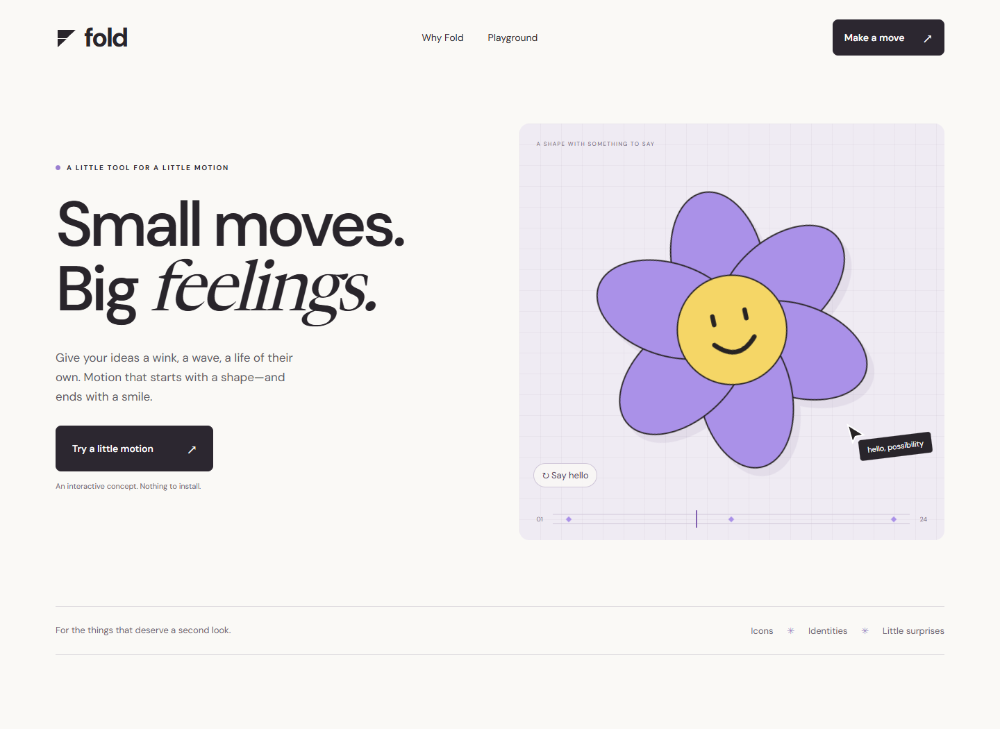
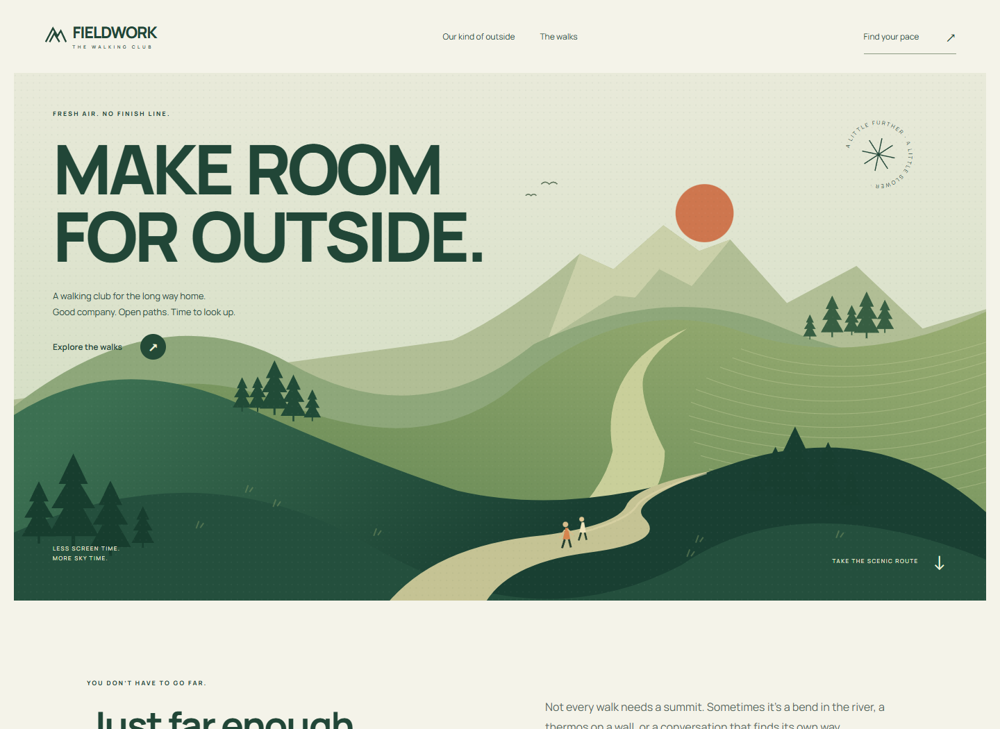

# Blend

A coordinated suite of **10 frontend skills** for product-specific design, typography, interfaces, imagery, motion, and mascots. Use Blend for the whole project or invoke a specialist for a focused task.

The suite helps an agent make connected design decisions. It does not prescribe one font pairing, palette, page structure, animation library, or level of spectacle. A busy app, an editorial site, and a product launch should have different reasons behind their form.

## Install

Clone the repository, then install the skill folders with Python 3.9 or newer:

```sh
git clone https://github.com/mowafymxis/blend.git
cd blend
python scripts/install.py
```

The installer copies all ten folders into `$CODEX_HOME/skills`, or `~/.codex/skills` when `CODEX_HOME` is unset. It does not install the gallery, vendor files, or reference captures. Start a new task/session if your client caches its skill catalog.

To update an existing installation, including the former single Blend skill:

```sh
python scripts/install.py --replace
```

Existing matching folders are backed up under `.maintainer/install-backups/` before replacement. Custom changes remain in that backup; they are not automatically merged. Other installed skills are untouched. Use `--dest PATH` for a different skills directory and `--backup-dir PATH` for another backup location. Without `--replace`, any existing matching folder stops installation before changes to the skills.

For manual installation, copy **each folder inside `skills/`** into your skills directory, preserving the sibling names, and include the root `LICENSE` and `THIRD_PARTY_NOTICES.md` in each copied folder. Do not copy the repository itself as one `blend` folder: the old root `SKILL.md` layout has been replaced. Install the complete suite to retain cross-skill reference links.

## Choose the entry point

| Skill | Owns |
|---|---|
| [blend](skills/blend/SKILL.md) | Overall direction, scope, specialist selection, and integration |
| [blend-art-direction](skills/blend-art-direction/SKILL.md) | Reference interpretation, composition, visual character, and stylistic range |
| [blend-typography](skills/blend-typography/SKILL.md) | Type selection, real-text specimens, optical tuning, responsive and multilingual typesetting |
| [blend-interface](skills/blend-interface/SKILL.md) | App workflows, records, forms, navigation, state continuity, and useful copy |
| [blend-landing](skills/blend-landing/SKILL.md) | Offer, page argument, evidence, and conversion behavior |
| [blend-micro-motion](skills/blend-micro-motion/SKILL.md) | Small illustrated sequences, SVG details, and interruptible control feedback |
| [blend-scroll](skills/blend-scroll/SKILL.md) | Connected scroll stories, composed intermediate states, and reversible progress |
| [blend-visual-assets](skills/blend-visual-assets/SKILL.md) | Imagery, illustration, live 3D, fidelity, crops, and fallbacks |
| [blend-mascots](skills/blend-mascots/SKILL.md) | Character identity, rigs, acting, real event states, and quiet modes |
| [blend-review](skills/blend-review/SKILL.md) | Rendered craft, task behavior, temporal evidence, and proportional revision |

```text
Use $blend to build a repair scheduling app with a distinct identity.
Make finding a job, editing it, and returning to the queue feel effortless.
```

```text
Use $blend-micro-motion to animate this small illustration inside the card.
Keep the card, text, and action stable. Make the sequence clean on repeat use.
```

```text
Use $blend-typography to improve this editorial page using our actual copy.
Preserve our brand and compare suitable type roles before choosing.
```

Blend loads only relevant specialists. A specialist can be used directly without running the coordinator first. This is modular guidance, not a requirement to spawn multiple agents or apply every effect.

## What the references teach

The [reference lenses](skills/blend-art-direction/references/reference-lenses.md) separate observed appearance, motion evidence, and reusable principles from the supplied Claude Design, Apple, OpenClaw, and mascot references. They teach stable reading surfaces around local animation, resolved product imagery, coherent visual worlds, and economical character acting. They do not bundle those sites' artwork or turn their styling into defaults.

## Technique examples

Two handcrafted landing pages with different ideas, compositions, and interactive demonstrations. They are technique examples, not default templates or evidence of consistent model output quality.

[](examples/fold/index.html)

**Fold** introduces a playful motion tool through an original paper flower, small illustrated gestures, and a working animation playground. Choose a personality, change its timing, and download the result as an animated SVG. [Explore its source](examples/fold/index.html).

[](examples/fieldwork/index.html)

**Fieldwork** introduces an unhurried walking club through an original landscape illustration, bold typography, and a trail selector. Switch between three imagined routes, watch the map redraw, and download the selected field notes. [Explore its source](examples/fieldwork/index.html).

Both brands are fictional. Fold exports a local demonstration, not a full animation editor. Fieldwork's routes and distances are illustrative; no real outings, navigation, bookings, or signups are offered.

```sh
python -m http.server 18789 --bind 127.0.0.1
```

Open [the local gallery](http://127.0.0.1:18789/examples/). There is no build step. Fonts and illustrations are bundled; viewing requires no third-party asset requests. See [example behavior and checks](examples/README.md).

## Maintain and verify

```sh
python scripts/validate.py
python scripts/test_install.py
```

The first command checks suite metadata and local Markdown destinations. The second exercises fresh installation, existing-folder refusal, backup preservation, and rollback after an interrupted replacement in a temporary directory. Neither establishes design quality.

Keep reusable instructions under `skills/`, packaging utilities under `scripts/`, and demonstrations under `examples/`. Keep research captures, trial outputs, and reports in the ignored `.maintainer/` directory. Preserve attribution when moving adapted guidance.

For behavioral evaluation use the [review method](skills/blend-review/references/verification.md) and [varied evaluation briefs](skills/blend-review/references/evaluation-briefs.md). Compare actual fresh outputs and task behavior before claiming improved autonomous taste. Structural validation and handcrafted showcases cannot prove consistent output quality.

## Credits

Blend retains selected premium-frontend and frontend-motion-design guidance, ideas from [Taste Skill](https://github.com/Leonxlnx/taste-skill), and landing-page guidance adapted from [Elaya's AI Design Skills](https://github.com/elayadesign/ai-design-skills). See [attribution](THIRD_PARTY_NOTICES.md) and the [MIT license](LICENSE).
