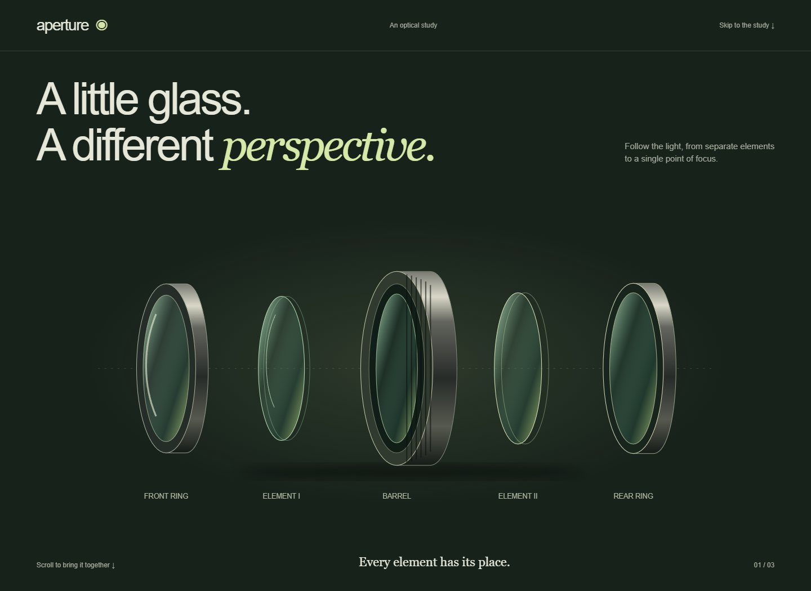
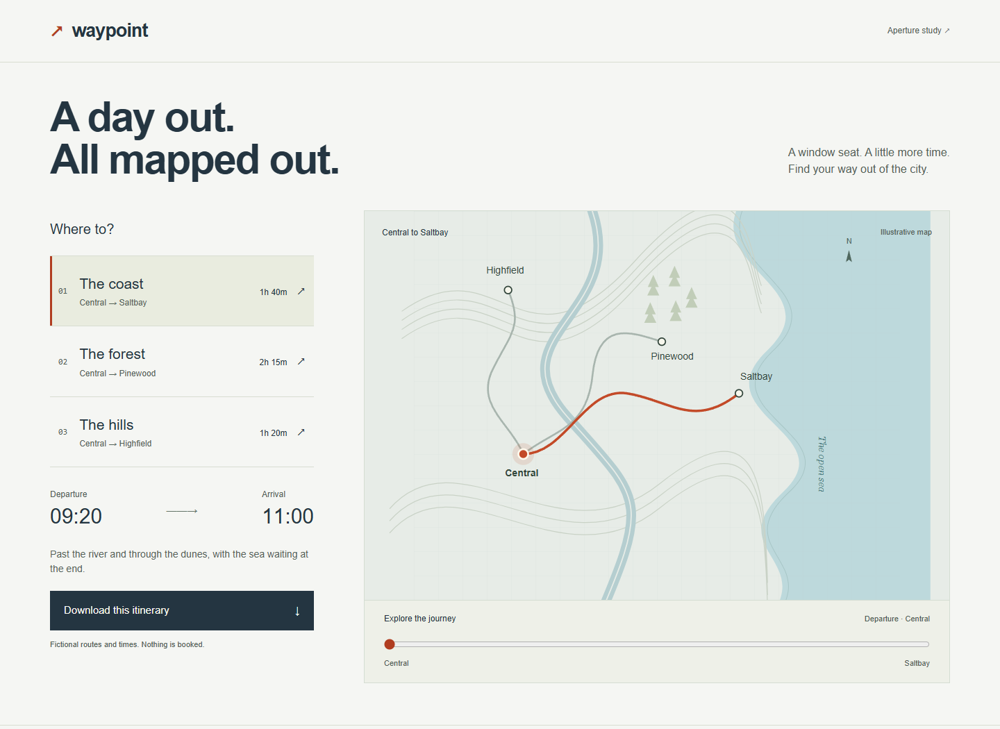

# Blend

A design skill for distinctive frontends, complete task flows, and motion with clear staging, continuity, and pace. Blend helps agents choose a direction, build it, and revise the rendered result.

## See it in motion

### Aperture · A study in light

[](examples/aperture/index.html)

A live SVG assembly driven by scroll: separated elements align, hold, and reveal a converging light path. Reverse scrolling takes it apart. Narrow screens use a larger, compact still. [Explore Aperture](examples/aperture/index.html), or [watch a captured scroll traversal](assets/aperture-motion.gif).

### Waypoint · A day out

[](examples/waypoint/index.html)

Choose a destination, scrub along the route, and download the matching itinerary. Changing destination retains your journey progress; the marker retargets from its current position. [Explore Waypoint](examples/waypoint/index.html).

Both are fictional, dependency-free demonstrations with original SVG artwork. Aperture is an illustrative optical diagram, not a simulation. Waypoint has no live schedules or bookings. Still previews show composition; run the examples to inspect motion. [Run and verify](examples/README.md).

## Use Blend

Copy this repository into your Codex skills directory as a folder named `blend`. Keep `SKILL.md`, references, and examples together. No source skills need to be installed separately.

```text
Use $blend to build a product story where the object assembles as I scroll.
Use live elements, no video. Give it clear staging and a convincing final frame.
```

For existing work:

```text
Use $blend to refine this frontend. Preserve our copy, brand, and routes.
Inspect the render and fix the most important visual and motion weaknesses.
```

## Inside the skill

- [Core workflow](SKILL.md): scope, design, copy, behavior, and the visual revision pass.
- [Art direction](references/art-direction.md): composition, type roles, density, and assets.
- [Product workflows](references/product-workflows.md): navigation, records, forms, and task continuity.
- [Landing pages](references/landing-pages.md): offer, evidence, conversion paths, and discovery checks.
- [Motion direction](references/motion-direction.md): staging, continuity, pacing, holds, and diagnosing an off-feeling scene.
- [Motion recipes](references/motion-recipes.md), [scroll scenes](references/scroll-scenes.md), and [3D and mascots](references/3d-and-mascots.md): conditional techniques, not required effects.
- [Verification](references/verification.md): behavior checks and evaluating draft quality across fresh runs.

## Develop and verify

With Python 3 installed, serve the repository from its root:

```sh
python -m http.server 18789 --bind 127.0.0.1
```

Open [the example gallery](http://127.0.0.1:18789/examples/). There is no package installation or build step. Follow the [example checks and preview instructions](examples/README.md) after changes. Keep local captures and experiments in ignored `.maintainer/`; commit only selected documentation previews. Handcrafted examples demonstrate possibilities, not reliable improvements across future model runs.

## Credits

Blend combines premium-frontend and frontend-motion-design guidance with ideas from [Taste Skill](https://github.com/Leonxlnx/taste-skill) and landing-page guidance adapted from [Elaya’s AI Design Skills](https://github.com/elayadesign/ai-design-skills). It selectively adapts these sources rather than inheriting every styling rule. See [attribution](THIRD_PARTY_NOTICES.md) and the [MIT license](LICENSE).
