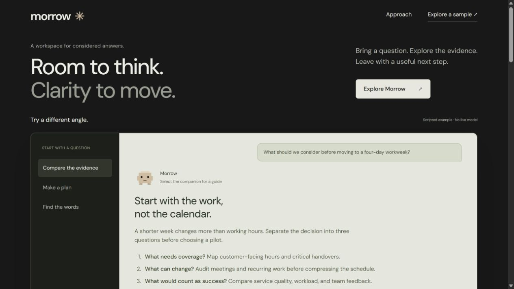
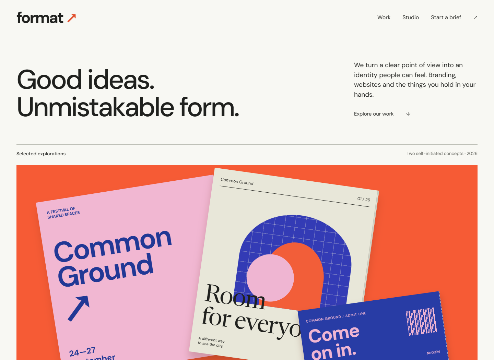

# Blend

A coordinated suite of **11 frontend skills** that understands your intended shape and feel, then clarifies the few choices that matter: typography, light/dark themes, layout, illustration, mascots, small animations, atmosphere, and scroll storytelling. Use Blend for a whole project or a specialist for a focused task.

New builds and substantial redesigns start by interpreting your brief and references. Blend asks roughly three to five focused questions only when needed, then designs within that direction. Existing answers are reused; narrow fixes stay narrow. You can ask for specimens, delegate a choice, or explicitly skip questions. The suite does not prescribe a font pairing, palette, page structure, animation library, or level of spectacle.

```text
You: Build a premium AI homepage with a mascot and clean drawn animations.
Blend: Infers the visual direction, then asks about the few unresolved choices,
       such as theme, character identity, or a major scroll scene.
You: Choose dark, clean sans, an original pixel companion, and no pinned scroll.
Blend: Records those choices, resolves remaining questions, then builds to them.
```

## Install

Clone the repository, then install the skill folders with Python 3.9 or newer:

```sh
git clone https://github.com/mowafymxis/blend.git
cd blend
python scripts/install.py
```

The installer copies all eleven folders into `$CODEX_HOME/skills`, or `~/.codex/skills` when `CODEX_HOME` is unset. It does not install the gallery or reference captures. Start a new task/session if your client caches its skill catalog.

To update an existing installation, including the former single Blend skill:

```sh
python scripts/install.py --replace
```

Existing matching folders are backed up under `.maintainer/install-backups/` before replacement. Custom changes remain in that backup; they are not automatically merged. Other installed skills are untouched. Use `--dest PATH` for a different skills directory and `--backup-dir PATH` for another backup location. Without `--replace`, any existing matching folder stops installation before changes to the skills.

For manual installation, copy **each folder inside `skills/`** into your skills directory, preserving the sibling names, and include the root `LICENSE` and `THIRD_PARTY_NOTICES.md` in each copied folder. Do not copy the repository itself as one `blend` folder: the old root `SKILL.md` layout has been replaced. Install the complete suite to retain cross-skill reference links.

## Choose the entry point

| Skill | Owns |
|---|---|
| [blend](skills/blend/SKILL.md) | Intent-led coordination, scope, specialist selection, and integration |
| [blend-discovery](skills/blend-discovery/SKILL.md) | Shape/feel inference, focused questions, and a compact decision record |
| [blend-art-direction](skills/blend-art-direction/SKILL.md) | Reference interpretation, composition, visual character, and stylistic range |
| [blend-typography](skills/blend-typography/SKILL.md) | Type selection, real-text specimens, optical tuning, responsive and multilingual typesetting |
| [blend-interface](skills/blend-interface/SKILL.md) | App workflows, records, forms, navigation, state continuity, and useful copy |
| [blend-landing](skills/blend-landing/SKILL.md) | Offer, page argument, evidence, and conversion behavior |
| [blend-micro-motion](skills/blend-micro-motion/SKILL.md) | Small illustrated sequences, SVG details, and interruptible control feedback |
| [blend-scroll](skills/blend-scroll/SKILL.md) | Connected scroll stories, composed intermediate states, and reversible progress |
| [blend-visual-assets](skills/blend-visual-assets/SKILL.md) | Imagery, illustration, live 3D, fidelity, crops, and fallbacks |
| [blend-mascots](skills/blend-mascots/SKILL.md) | Character identity, rigs, acting, real event states, and quiet modes |
| [blend-review](skills/blend-review/SKILL.md) | Rendered craft, task behavior, temporal evidence, and proportional revision |

```text
Use $blend to build a repair scheduling app with a distinct identity.
Make finding a job, editing it, and returning to the queue feel effortless.
```

```text
Use $blend-micro-motion to animate this small illustration inside the card.
Keep the card, text, and action stable. Make the sequence clean on repeat use.
```

```text
Use $blend-typography to improve this editorial page using our actual copy.
Preserve our brand and compare suitable type roles before choosing.
```

Blend loads only relevant specialists. A specialist can be used directly without running the coordinator first. This is modular guidance, not a requirement to spawn multiple agents or apply every effect.

The [question guide](skills/blend-discovery/references/question-bank.md) helps select only high-impact questions. The [internal brief](skills/blend-discovery/references/design-brief.md) distinguishes user answers from supported inferences and implementation choices. User-facing questionnaires contain only questions and answer spaces.

## What the references teach

The [reference lenses](skills/blend-art-direction/references/reference-lenses.md) separate observed appearance, motion evidence, and reusable principles from the supplied Claude Design, Apple, OpenClaw, and mascot references. They teach stable reading surfaces around local animation, resolved product imagery, coherent visual worlds, and economical character acting. They do not bundle those sites' artwork or turn their styling into defaults.

## Reference-led quality

The [quality calibration guide](skills/blend-art-direction/references/quality-bar.md) turns reference comparisons into visible decisions: subject scale, page composition, typography, artwork, reading density, and concentration of motion. It distinguishes an attractive surface treatment from a resolved design without imposing one house style.

The [staged illustration guide](skills/blend-micro-motion/references/staged-illustrations.md) closely analyzes the supplied card recording and separates observation from implementation. It covers a fixed frame, internal reconfiguration, accent return, mark resolution, recognition time, and explicit interruption/replay policies. A root-level bounce is not a substitute for that choreography.

The specialists also cover [drawn illustration craft](skills/blend-micro-motion/references/drawn-illustrations.md), [ambient fields](skills/blend-micro-motion/references/ambient-motion.md), [light/dark surfaces](skills/blend-art-direction/references/themes-and-surfaces.md), and [live, video, or frame-based cinematic scenes](skills/blend-scroll/references/cinematic-media.md). Quality review checks the user's selected direction as well as still and moving states.

## Technique examples

Two original company landing pages apply the suite to different offers, reading structures, and visual material. They are handcrafted demonstrations, not default templates or evidence of consistent model output quality.

The existing examples predate the interview workflow. Use the separate [Morrow and Format redesign questionnaires](examples/redesign-questions.md) to choose their next direction before rebuilding them.

[](examples/morrow/index.html)

**Morrow** is a fictional AI company. An original paper mascot accompanies a quiet editorial introduction and a working, explicitly scripted conversation demo. Three small illustrated scenes withdraw, reorganize, return, and resolve inside stationary cards. Switch the sample conversation, copy its response, or replay a drawing. [Explore its source](examples/morrow/index.html).

[](examples/format/index.html)

**Format** is a fictional design company. Original festival and pantry identity systems lead the page; project details explain the work. A print-registration illustration separates and aligns its colour layers before a finishing mark resolves. The brief builder downloads the visitor's own project notes locally. [Explore its source](examples/format/index.html).

Morrow has no live model, and Format has no real clients or submission service. Both label their illustrative content and keep the interactive actions local. No signup, purchase, or inquiry is sent.

```sh
python -m http.server 18789 --bind 127.0.0.1
```

Open [the local gallery](http://127.0.0.1:18789/examples/). There is no build step. Fonts and illustrations are bundled; viewing requires no third-party asset requests. See [example behavior and checks](examples/README.md).

## Maintain and verify

```sh
python scripts/validate.py
python scripts/test_install.py
```

The first command checks suite metadata and local Markdown destinations. The second exercises fresh installation, existing-folder refusal, backup preservation, and rollback after an interrupted replacement in a temporary directory. Neither establishes design quality.

Keep reusable instructions under `skills/`, packaging utilities under `scripts/`, and demonstrations under `examples/`. Keep research captures, trial outputs, and reports in the ignored `.maintainer/` directory. Preserve attribution when moving adapted guidance.

For behavioral evaluation use the [review method](skills/blend-review/references/verification.md) and [varied evaluation briefs](skills/blend-review/references/evaluation-briefs.md). Compare actual fresh outputs and task behavior before claiming improved autonomous taste. Structural validation and handcrafted showcases cannot prove consistent output quality.

## Credits

Blend retains selected premium-frontend and frontend-motion-design guidance, ideas from [Taste Skill](https://github.com/Leonxlnx/taste-skill), and landing-page guidance adapted from [Elaya's AI Design Skills](https://github.com/elayadesign/ai-design-skills). See [attribution](THIRD_PARTY_NOTICES.md) and the [MIT license](LICENSE).
