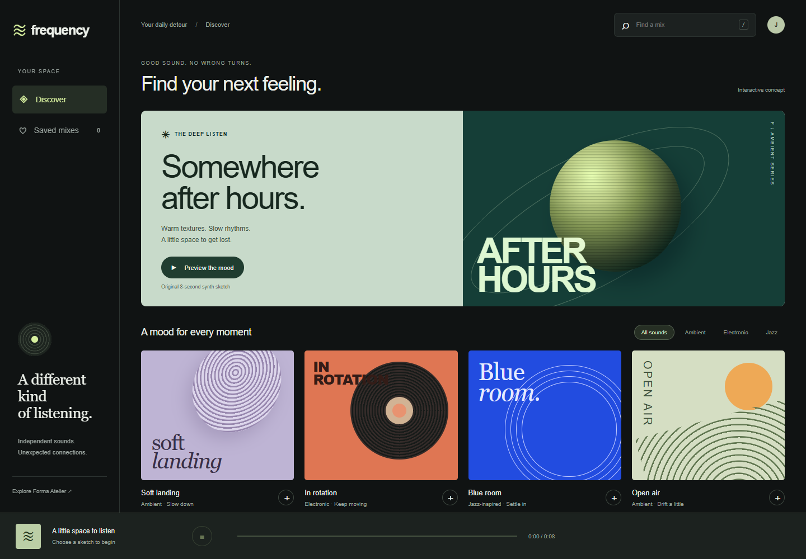
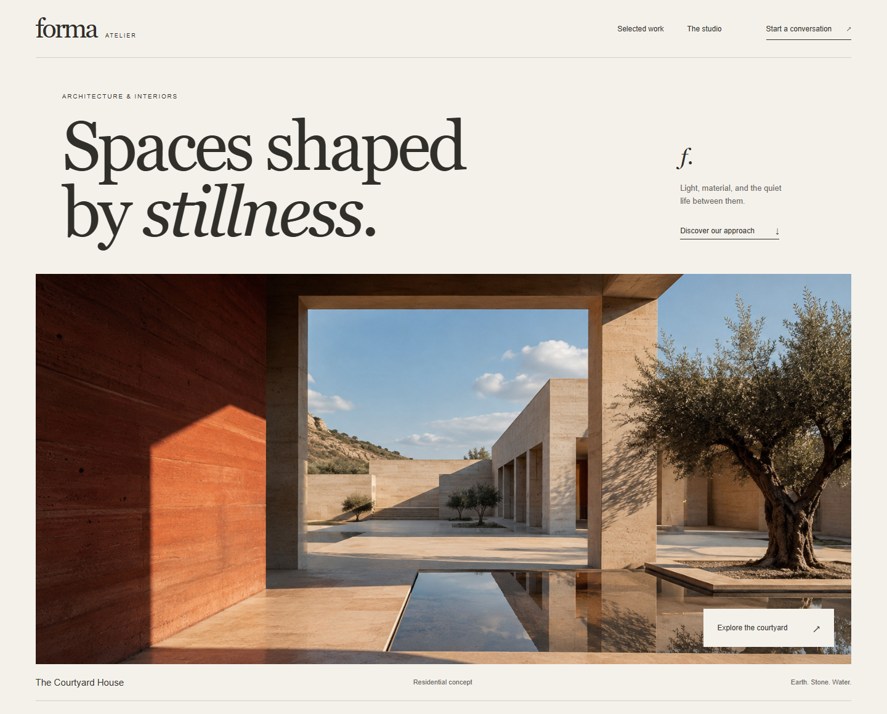

# Blend

A frontend skill for deliberate design, concise copy, and motion that feels part of the product. Build anything from a quiet workspace to a scroll-controlled product story, with drawing effects, spatial animation, and original mascots.

## Built with Blend

### Frequency — music discovery

[](examples/frequency/index.html)

A compact listening workspace with original cover art, searchable mixes, genre filters, saved selections, and playable synth sketches. [Explore the example](examples/frequency/index.html).

### Forma Atelier — architecture portfolio

[](examples/architecture/index.html)

A quiet architectural portfolio with large image crops, warm typography, and an accessible project dialog. Original AI-generated concept imagery. [Explore the example](examples/architecture/index.html).

Both examples are runnable concept projects. [Run them locally](examples/README.md).

## Try it

Ask Codex:

```text
Use $skill-installer to install https://github.com/mowafymxis/blend
from path . with the name blend.
```

Then, on your next turn:

```text
Use $blend to polish this frontend. Preserve the existing copy and brand.
Draw the small accent on hover and focus, and make state changes feel coherent.
```

Or copy this repository into your Codex skills directory as a folder named `blend`. The folder's `SKILL.md` is the entry point; keep its references and examples alongside it. The skill is self-contained and does not require the source skills to be installed.

For a new landing page:

```text
Use $blend to build a landing page for this offer. Make the next step clear,
address the audience's main objections, and use only the proof and terms
I supplied. Choose the layout and motion to fit the brand.
```

## What's inside

- [SKILL.md](SKILL.md): the core design and implementation workflow.
- [References](references/verification.md): focused guidance for copy, motion, scroll scenes, 3D, mascots, and quality checks.
- [Landing pages](references/landing-pages.md): offer strategy, evidence, page structure, conversion paths, and search/share checks, without a fixed visual style.
- [Examples](examples/README.md): the two frontend showcases and a small motion lab.

## Contributing

Keep the skill self-contained and changes scoped. Check relative links and exercise affected examples on desktop, mobile, keyboard, and reduced motion. Use the [verification guide](references/verification.md) when changing behavior.

## Credits

Blend combines premium-frontend and frontend-motion-design with ideas from [Taste Skill](https://github.com/Leonxlnx/taste-skill) and landing-page guidance adapted from [Elaya's AI Design Skills](https://github.com/elayadesign/ai-design-skills). See [attribution](THIRD_PARTY_NOTICES.md) and the [MIT license](LICENSE).
